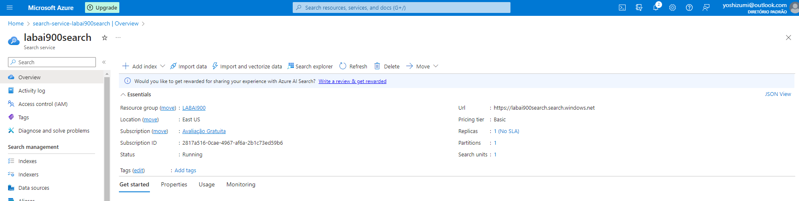
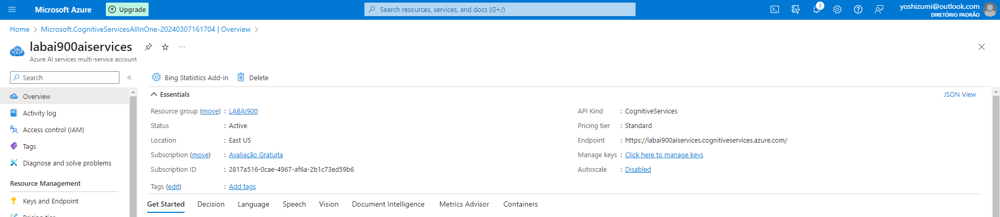
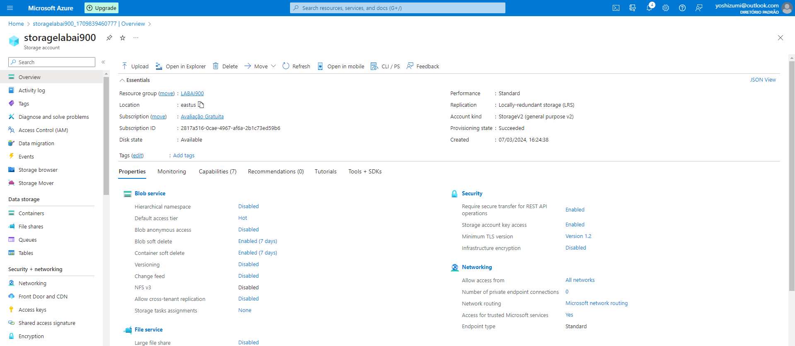
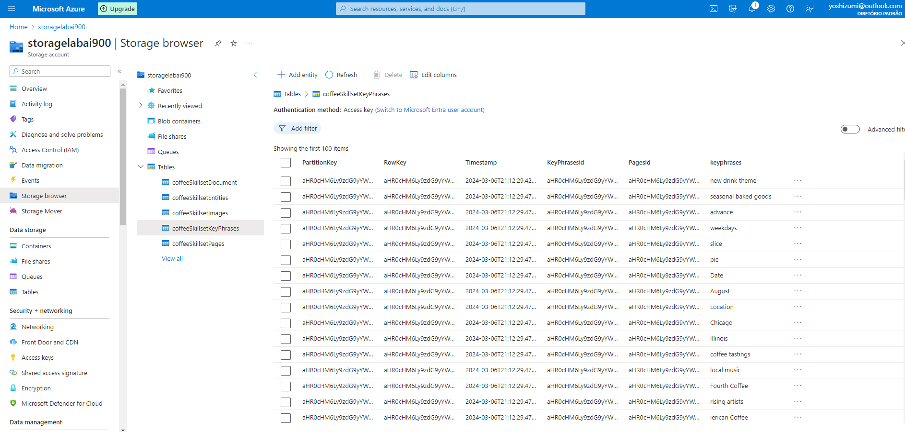

# Aula: Azure Cognitive Search: Utilizando AI Search para indexação e consulta de Dados

Passo a passo do projeto Azure Cognitive Search: Utilizando AI Search para indexação e consulta de Dados da DIO.

Links importantes:

[Explore an Azure AI Search index (UI)](https://microsoftlearning.github.io/mslearn-ai-fundamentals/Instructions/Labs/11-ai-search.html)

[Fazer o download dos reviews da cafeteria](https://aka.ms/mslearn-coffee-reviews)

Objetivo deste lab:

* Criar recursos da Azure
* Extrair dados de um data source
* Enriquecer dados com skills da IA
* Usar indexadores Azure no portal Azure
* Fazer buscas no seu índice de pesquisa
* Verificar resultados salvos em uma Knowledge Store

## Passo 1: Criando recursos necessários na Azure

Será necessário criar os serviços:
* Azure AI Search
* Azure AI services
* Storage account

Entrar no https://portal.azure.com.

Azure AI Search

* Entrar no https://portal.azure.com.
* Clicar em "Criar recurso".
* Pesquisar por Azure AI Search no marketplace e selecionar para criar.
* Selecionar ou criar um Resource Group, escolher um nome para o serviço, escolher uma localização, preferencialmente fora do Brasil com o East US, por ser perto e mais barato, selecionar o Pricing Tier Basic. Clicar em Review + Create e se tudo estiver ok, criar o recurso.

Azure AI services

* Entrar no https://portal.azure.com.
* Clicar em "Criar recurso".
* Navegar no menu Categories > AI + Machine Learning, achar o Azure AI services e clicar no link Create.
* Selecionar o Resource Group já criado anteriormente, escolher um nome para o serviço, escolher uma localização, preferencialmente fora do Brasil com o East US, por ser perto e mais barato, selecionar o Pricing Tier Standard S0. Clicar no check box que entende os termos. Clicar em Review + Create e se tudo estiver ok, criar o recurso.

Storage Account

* Entrar no https://portal.azure.com.
* Clicar em "Criar recurso".
* Navegar no menu Categories > Storage, achar o Storage account e clicar no link Create.
* Selecionar o Resource Group já criado anteriormente, escolher um nome para o serviço, escolher uma localização, preferencialmente fora do Brasil com o East US, por ser perto e mais barato, selecionar Performance Standard, e a redundancia deixar como Locally-redundant storage (LRS). Clicar em Review + Create e se tudo estiver ok, criar o recurso.

## Passo 2: Extrair dados de um data source

* Seguir o documento e fazer upload dos reviews no container da storage.
* Indexar os documentos
* Adicionar cognitive skills
* Criar o indexador
* Fazer busca no indexador
* Verificar o conteúdo interno do indexador

